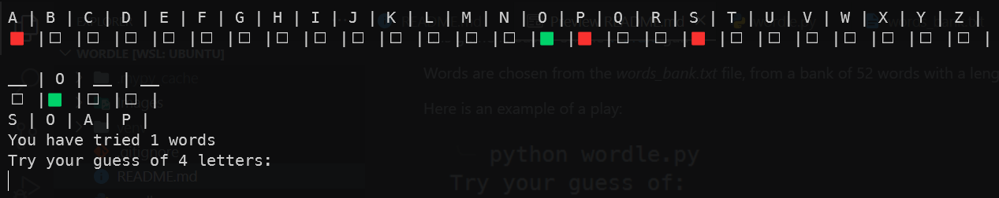
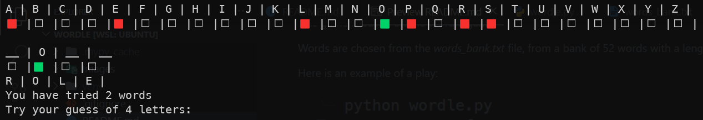
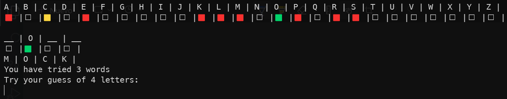
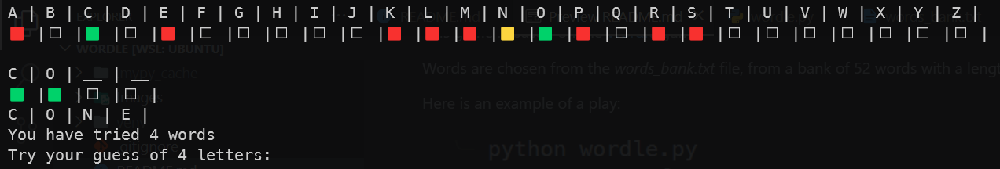
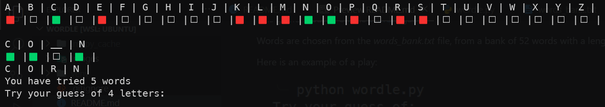
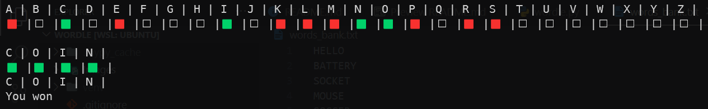

# Wordle
It is a word guessing game implemented to play on the command line. The game is played by typing a word of the length shown on the screen and then pressing enter. If a letter is in the word, but not in the correct position, it will be displayed as a yellow square. If a letter is in the word and in the correct position, it will be displayed as a green square. If a letter is not in the word, it will appear just the letter itself.

This game is based on the [Wordle](https://www.nytimes.com/games/wordle/index.html) game

Words are chosen from the *words_bank.txt* file, from a bank of 52 words with a length between 4 and 9 letters.

Here is an example of a play:\
\







This game is written in Python 3.8. The files needed to run the game are:
- *dictionary.txt*
- *four_letters_words.txt*
- *five_letters_words.txt*
- *six_letters_words.txt*
- *seven_letters_words.txt*
- *eight_letters_words.txt*
- *nine_letters_words.txt*
- *ten_letters_words.txt*
- *wordle.py*

And can be played by typing:
```bash
python3 wordle.py
```